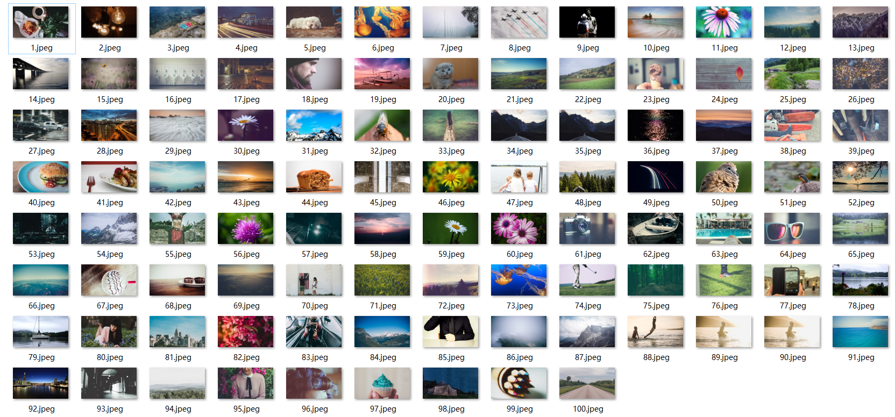

# PEXELS Crawler

## 项目背景
之前写过一个爬取Unsplash网站获取壁纸的代码[github地址](https://github.com/PP8818/Python-Projects/tree/master/py2/Unsplash_Crawling)和[介绍文章](https://zhuanlan.zhihu.com/p/25647976)，最近想用之前的代码更新一波壁纸，结果发现下载特别慢，还容易假死，所以之后自己重新找
了一个免费图片网址[PEXELS](https://www.pexels.com/)，再撸一波代码。

## 项目简介
本项目是一个爬虫程序，爬取的是一个免费的图片网站，图片精美很适合做壁纸，欢迎给star。  
相比之前的Unsplash，用PEXELS下载的好处是可以自定义下载图片的尺寸，代码中也有设置相应的变量，大家可以自己改。
作者用的小米笔记本，默认下载尺寸为1920*1080，最后有本人下载的图片百度云链接。

## 效果演示

## 代码原理
本代码主要是通过获取到该网站请求过程中一个带有图片网址的js文件，从中读取图片下载地址并下载。

## 代码使用
* 代码部分已有相应注释，在同目录中创建pic文件夹，可根据自己需要修改下载图片规格，下载页数，起始图片名称编号等。  
* 因为图片可能会比较大，可能请求较久导致假死，所以如果请求超过5s会跳过图片并有提示。  
* 如果长时间出现timeout或者failed提示，请检查网络速度并重新执行。

## 结语
如果不想折腾，本人直接提供100张1920*1080壁纸，笔记本上清晰度足够而且不是很大，可以直接下载
链接：http://pan.baidu.com/s/1geUdmeR 密码：5byd

star就在上面，记得点一下喔!!!