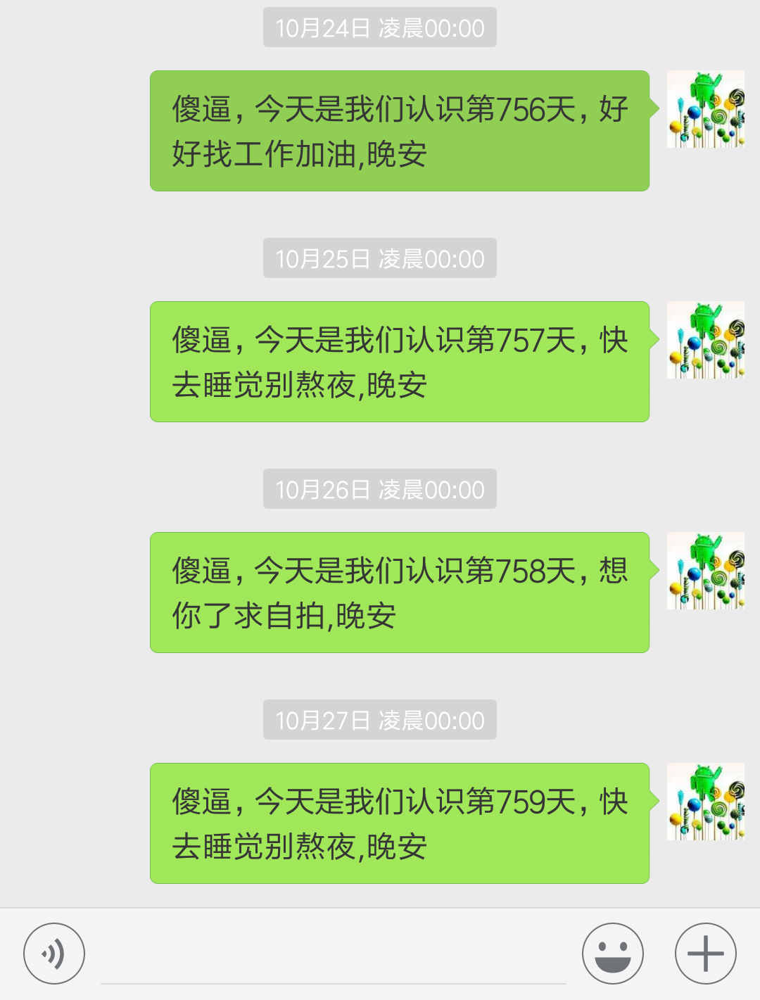

# 40行代码搞定女友日常问候微信机器人

## 前言
作为一个程序狗，有个女朋友不容易，关键是女朋友还有各种各样的要求，比如每天晚上12点说晚安，每个纪念日要记得。这可让程序员如何是好，要知道，晚上12点，对我们来说晚上才刚刚开始；纪念日对我们来说就是写完一个project的日子。

所以，对于女朋友提出的需求，作为程序员的我们，当然不能坐视不管了，我们要写个程序来搞定它。

## 环境
先看看效果，微信号会在每天设定的时间按时按点发问候语给设定好的另一个微信号，同时可以自动进行一些相应的计算并更新每一天的内容，内容方面，就要靠大家丰富的想象力啦，这里只是给个演示。至于为什么问候只持续到10月27日，嗯...，这就是一个尴尬的故事了。

## 技术原理
技术原理部分，说简单也很简单，都是利用python现成的库来实现的，所以代码量很少，只有区区40行。大概的过程就是先使用电脑登录接口登录个人微信，然后挂着微信，在电脑是进行定时和内容操作，并完成发送。

代码中用到的代码包itchat和apscheduler是不自带的，所以需要我们自行安装，其中，itchat是微信网页端的相关接口包，apscheduler是python定时服务包。就安装过程也非常简单，在命令行中输入：
> pip install itchat

> pip install apscheduler

代码中有详细的注释可帮助理解。

## 尾巴
至此，这个小小的程序就写完了，40行代码搞定，每天准时问候女友。当然，只需要稍微一改，很容易就能变成了周年纪念日提醒，100天提醒等等。这个就靠大家发挥想象力啦！

如果觉得这个项目不错，记得点击右上角star一下！

